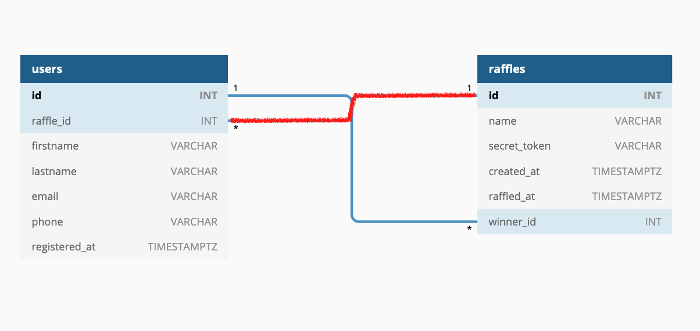

# Raffle-It

FSW application for users to create raffles, users also get the option to signup for any raffle they want, and the admin of the rsffle to randomly pick a winner.

## Tools used

- Node.js installed
- PostgresSQL installed
- A PostgresSQL Client installed to connect to and set up your database
- [Postman] installed to test out the endpoints.
- Express Generator.
- install nodemon as a dev-dependency
- Run the server using nodemon ./bin/www
- Run the client using npm run

## Technical Requirements

- Create raffles
- List all raffles
- Add participants users to raffles
- Draw a winner from a raffle


### Database
The diagram below shows tables `users` and `raffles` and their relationships.



### Server

Create an express server with the following endpoints.

#### Endpoints

##### GET `/raffles`

Retrieve all raffles.

##### POST `/raffles`

Post a new raffle. The JSON body to send in the request should include a `name` and `secret_token` property.

Example POST body: 

```json
{ 
  "name": "My first Raffle", 
  "secret_token": "s3CrE7" 
}
```

##### GET `/raffles/:id`

Retrieve a single raffle by its id.

##### GET `/raffles/:id/participants`

Retrieve all user participants of a raffle.

##### POST `/raffles/:id/participants`

Sign up a participant to a raffle given a raffle id. The JSON body to send must include `firstname`, `lastname`, and `email`.
`phone` is optional

`email` should be unique to protect from the same user signing multiple times for the same raffle.

Example body: 

```json
{ 
  "firstname": "Jane",
  "lastname": "Doe",
  "email": "jdoe@email.com",
  "phone": "+1 (917) 555-1234",
}
```

##### PUT `/raffles/:id/winner`

Selects the winner at random picking from the users that are signed up for the raffle specified by id and return it. A winner will be picked only if the request body includes a secret token that matches the token used when the raffle was created via POST `/raffles`.  If the token is not present or doesn't match return an error message.

Example POST body:

```json
{ "secret_token" : "s3CrE7" }
```

If drawing a winner is successful return the winner user. For example:

```json
{
    "id": 2,
    "raffle_id": 1,
    "firstname": "John",
    "lastname": "Snow",
    "email": "jblizzard@email.com",
    "phone": null,
    "registered_at": "2021-05-22T15:43:52.647Z"
}
```

**Note:** If a winner is attempted to be picked multiple times don't allow it and return the existing winner instead. Multiple identical PUT request should have the same result, this is the definition of [idempotence](https://developer.mozilla.org/en-US/docs/Web/HTTP/Methods/PUT#:~:text=The%20difference%20between%20PUT%20and,placing%20an%20order%20several%20times.).

#### Bonus Endpoints

##### GET `/raffles/:id/winner`

Retrieve the winner of a raffle.

##### GET `/raffles/:id?active=<false|true>`

Using a query param `active`, return raffles that are "active" (`active=true`), meaning they don't have a winner yet or raffles that already have a winner (`active=false`)


# Raffle-It
# Raffle-It
